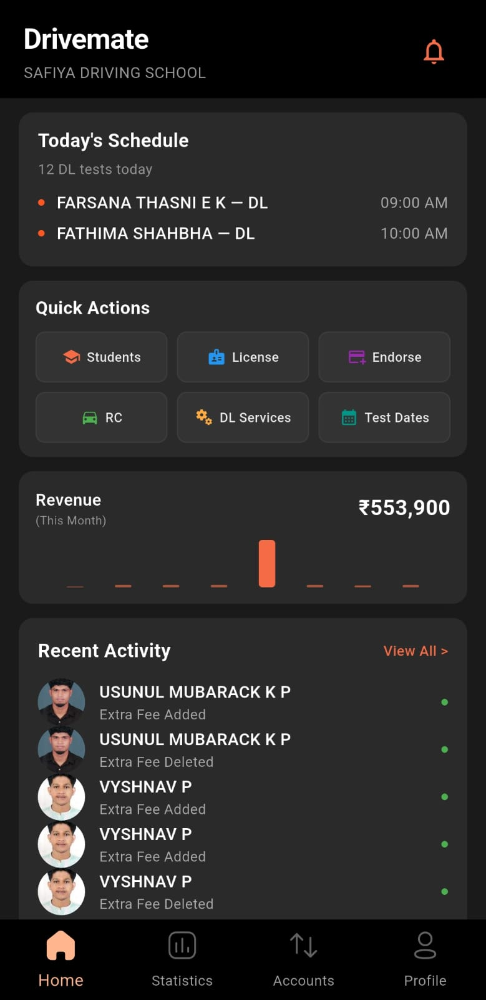
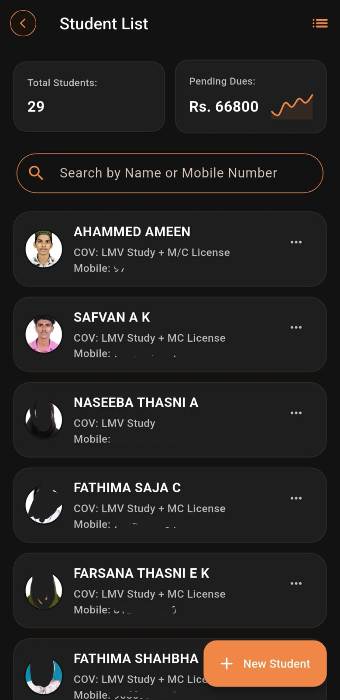
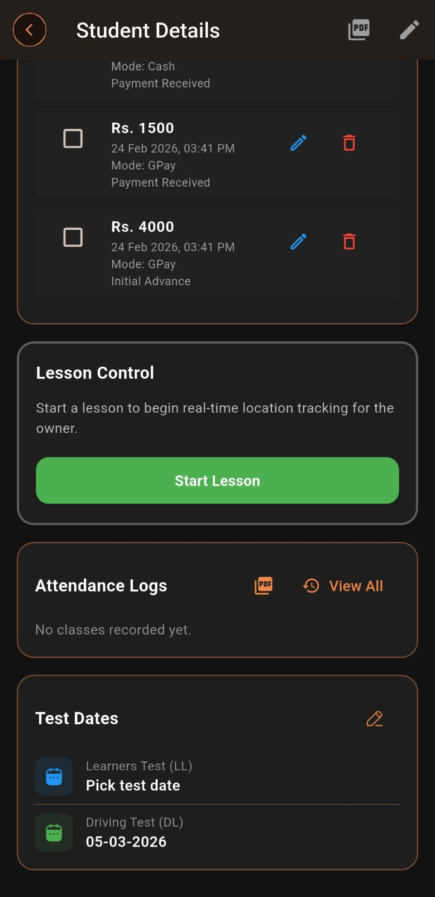
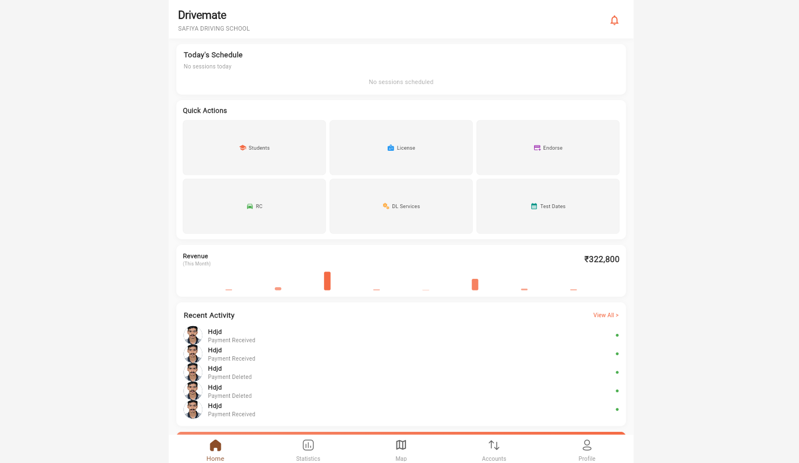

<div align="center">

# 🚗 Drivemate


</div>

<p align="center">
  <strong>Drivemate</strong> is a sleek Android app for managing driving school operations — including student data, class tracking, vehicle info, and income/expense tools — all in one place.
</p>

---

## 🚀 Download (Latest APK)

📥 Grab the **latest build** here:

➡️ **https://github.com/nabeelkts/drivemate/releases/latest/download/drivemate.apk**

> ⬆️ This link always points to the newest APK automatically.

---

## ✨ Key Features

- 📊 **Driving School Data Management**
  - Student records
  - Course tracking
  - Trainer & vehicle assignments

- 💰 **Finance Tools**
  - Income & expense entries
  - Expense categories
  - Summary reports

- 📋 **User-friendly Interface**
  - Optimized Android experience

- 🔄 Auto-update friendly via GitHub Releases

*(Add additional features as needed — basic structure from your project contents)*

---

## 📱 Mobile Preview

<p align="center">
  
  
  
  
  
</p>

---

## 🌐 Web Preview

<p align="center">
  
</p>
---

## 🛠️ Tech Stack

| Technology | Purpose |
|------------|---------|
| Android | UI & Platform |
| Kotlin / Java | Core Logic |
| GitHub Releases | APK distribution |
| SQLite/Local DB | Offline storage |

---

## 📦 Installation

1. Enable **Install Unknown Apps** on your Android device.
2. Download the **APK** using the link above.
3. Install and open the app.
4. Enjoy managing your driving school!

---

## 🔧 Development

Want to contribute or build locally?

```bash
git clone https://github.com/nabeelkts/drivemate.git
cd drivemate
# Open in Android Studio or your favorite IDE


