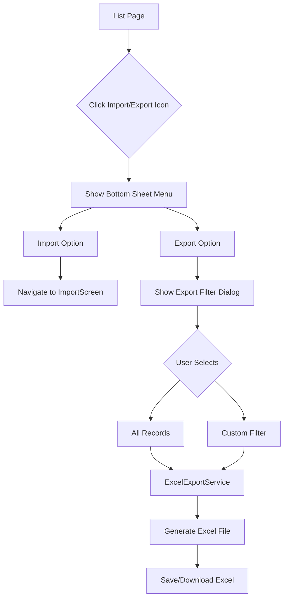

# Export Feature Implementation Plan

## Overview
Add export functionality alongside the existing import feature in the DriveMate app. When users click the icon in list pages, they will see a bottom sheet menu with options for both Import and Export.

## Architecture

### Mermaid Diagram: Export Feature Flow



## Implementation Steps

### Step 1: Create Excel Export Service
- **File**: `lib/services/excel_export_service.dart`
- Create new service class `ExcelExportService`
- Add export methods for each data type:
  - `exportStudents()`
  - `exportLicenseOnly()`
  - `exportEndorsement()`
  - `exportDlServices()`
  - `exportVehicleDetails()`
- Use the same column mapping as import for consistency
- Support filtering options:
  - All records
  - By date range
  - By balance status (pending dues)

### Step 2: Update BaseListWidget
- **File**: `lib/screens/widget/base_list_widget.dart`
- Add `onExport` callback parameter
- Change single import icon to a menu icon (Icons.swap_vert or Icons.more_vert)
- Create `_buildImportExportMenu()` method that shows bottom sheet with:
  - Import Records option
  - Export Records option

### Step 3: Update List Pages Using BaseListWidget
- **LicenseOnlyList**: Add onExport callback
- **EndorsementList**: Add onExport callback
- **DlServicesList**: Add onExport callback
- **VehicleDetailsList**: Add onExport callback

### Step 4: Update StudentList
- **File**: `lib/screens/dashboard/list/students_list.dart`
- Replace single import icon with bottom sheet menu
- Add export functionality

### Step 5: Update AllServicesPage
- **File**: `lib/screens/profile/all_services_page.dart`
- Add Export Records option in Import & Export section
- Create `_showExportOptions()` method similar to `_showImportOptions()`

## Data Types and Column Mappings

The export will use the same column mappings as import to ensure compatibility:

| Import Type | Collection | Export Columns |
|-------------|------------|----------------|
| Student | students | fullName, guardianName, dob, mobileNumber, emergencyNumber, bloodGroup, house, place, post, district, pin, cov, totalAmount, advanceAmount, paymentMode |
| License Only | licenseonly | fullName, guardianName, dob, mobileNumber, bloodGroup, house, place, post, district, pin, cov, totalAmount, advanceAmount, paymentMode |
| Endorsement | endorsement | fullName, guardianName, dob, mobileNumber, license, cov, totalAmount, advanceAmount, paymentMode |
| DL Service | dlservices | fullName, guardianName, dob, mobileNumber, license, serviceType, totalAmount, advanceAmount, paymentMode |
| Vehicle Details | vehicleDetails | fullName, mobileNumber, house, place, post, district, pin, vehicleNumber, vehicleModel, chassisNumber, engineNumber, totalAmount, advanceAmount, paymentMode |

## UI Components

### Bottom Sheet Menu (List Pages)
```
┌─────────────────────────────┐
│        ▼                    │  (drag handle)
│                             │
│  Import & Export            │
│  ─────────────────────────  │
│                             │
│  📥 Import Records          │
│     Import from Excel       │
│                             │
│  📤 Export Records          │
│     Export to Excel         │
│                             │
└─────────────────────────────┘
```

### Export Filter Dialog
```
┌─────────────────────────────┐
│  Export Options            │
│  ─────────────────────────  │
│                             │
│  ○ All Records             │
│     Export all data         │
│                             │
│  ○ With Pending Dues       │
│     Only records with      │
│     balance > 0             │
│                             │
│  ○ Test Passed             │
│     Records that passed    │
│     the test               │
│                             │
│  ○ Test Failed             │
│     Records that failed    │
│     the test               │
│                             │
│  ○ By Date Range           │
│     Select start and end   │
│     date                   │
│                             │
│  [Export to Excel]         │
└─────────────────────────────┘
```

## Files to Modify
1. `lib/services/excel_export_service.dart` (NEW)
2. `lib/screens/widget/base_list_widget.dart`
3. `lib/screens/dashboard/list/students_list.dart`
4. `lib/screens/dashboard/list/license_only_list.dart`
5. `lib/screens/dashboard/list/endorsement_list.dart`
6. `lib/screens/dashboard/list/dl_services_list.dart`
7. `lib/screens/dashboard/list/vehicle_details_list.dart`
8. `lib/screens/profile/all_services_page.dart`

## Dependencies
The app already uses `excel` package for import, which will also be used for export.
